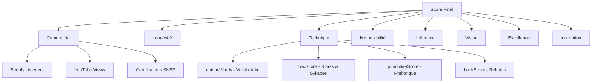
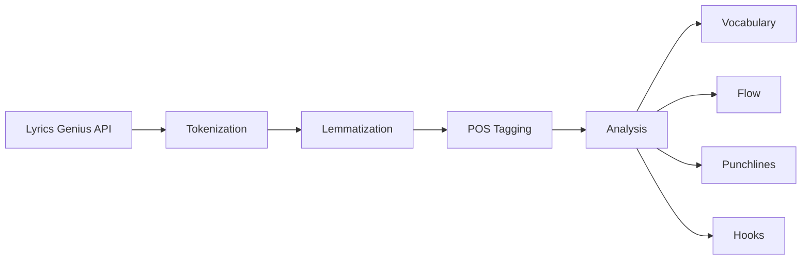

# 🎤 Rap FR OpenData

> Algorithme de classement objectif du rap français basé sur l'analyse NLP

[](https://rap-francais-opendata.pages.dev/)
[](https://github.com/lekalache/fr-rap-classement)


## 🌐 Demo Live

**👉 [rap-francais-opendata.pages.dev](https://rap-francais-opendata.pages.dev/)**

---

## 📖 À propos

**Rap FR OpenData** est un projet open-source qui classe objectivement les rappeurs français en analysant leurs lyrics avec des techniques de NLP (Natural Language Processing).

### Ce que vous découvrirez :

- 🏆 **Classement** de 38 rappeurs français selon 8 piliers
- 🔥 **Détecteur de punchlines** - Testez vos propres punchlines !
- 📊 **Visualisations** interactives (radar charts, évolution temporelle)
- 📥 **Open Data** - Téléchargez toutes les données (JSON, CSV, SQLite)

---

## 🧠 L'Algorithme : 8 Piliers



### Poids des piliers

| Pilier | Poids | Description |
|--------|-------|-------------|
| 🎵 Commercial | 20% | Streams, vues, certifications |
| ⏳ Longévité | 15% | Années d'activité, régularité |
| 🎯 Technique | 20% | Vocabulaire, flow, punchlines |
| 🎹 Mémorabilité | 10% | Hooks, refrains iconiques |
| 👑 Influence | 15% | Impact sur la culture rap |
| 🎨 Vision | 5% | Cohérence artistique |
| 💎 Excellence | 10% | Albums classiques |
| 🚀 Innovation | 5% | Apport au genre |

---

## 🔬 Pipeline NLP

L'analyse technique utilise **spaCy** avec le modèle français `fr_core_news_md` :



### Métriques calculées

| Métrique | Description | Méthode |
|----------|-------------|---------|
| `uniqueWords` | Vocabulaire unique | Comptage lemmes uniques |
| `flowScore` | Qualité du flow | Densité rimes + variations syllabiques |
| `punchlineScore` | Impact punchlines | Détection 10 patterns rhétoriques |
| `hookScore` | Mémorabilité | Répétitions + structure refrains |

---

## 🔥 Détecteur de Punchlines V3

L'algorithme détecte **10 patterns** de punchlines du rap français :

| Pattern | Exemple | Poids |
|---------|---------|-------|
| Comparaison | "comme un..." | 18% |
| Paradoxe | "mais", "pourtant" | 18% |
| Menace Si/Alors | "Si tu..." | 15% |
| Question rhétorique | "Qui peut...?" | 12% |
| Jeu de mots | Homophones | 12% |
| Aphorisme | "La vie c'est..." | 12% |
| Quantification | "100 fois" | 10% |
| Intensité | Mots forts | 10% |
| Référence culturelle | Scarface, Jordan | 8% |
| Chiasme | A-B / B-A | 8% |

### Bonus

- ✅ **Brièveté** (8-20 mots) : +15 points
- ✅ **Référence personnelle** ("j'suis", "mon") : +8 points
- ✅ **Connecteur de chute** ("mais", "pourtant") : +12 points
- ❌ **Noms de marques** (Gucci, Rolex) : -8 points chacun

---

## 📊 Données Open Data

### Téléchargements disponibles

| Format | Contenu | Taille |
|--------|---------|--------|
| **JSON** | 38 artistes + métriques | ~50 KB |
| **CSV** | Tableau Excel/Sheets | ~15 KB |
| **SQLite** | 1,901 lyrics complètes | 8.2 MB |

### Structure SQLite

```sql
-- Tables disponibles
SELECT * FROM artists;        -- 38 artistes
SELECT * FROM songs;          -- 1,901 chansons avec paroles
SELECT * FROM analysis_cache; -- Scores NLP pré-calculés
```

---

## 🛠️ Stack Technique

### Frontend
- **React 18** + TypeScript
- **Vite** (build tool)
- **Tailwind CSS** (styling)
- **Recharts** (graphiques)
- **Mermaid** (diagrammes)

### Backend / Data Pipeline
- **Python 3.11**
- **spaCy** (`fr_core_news_md`)
- **SQLite** (stockage lyrics)
- **Genius API** (collecte paroles)

### Déploiement
- **Cloudflare Pages**
- **GitHub Actions** (CI/CD)

---

## 🚀 Installation locale

```bash
# Clone
git clone https://github.com/lekalache/fr-rap-classement.git
cd fr-rap-classement

# Install dependencies
npm install

# Run dev server
npm run dev
```

### Pipeline NLP (optionnel)

```bash
cd data-pipeline
python -m venv venv
source venv/bin/activate
pip install -r requirements.txt
python -m spacy download fr_core_news_md

# Analyser un artiste
python scripts/analyze_artist.py "Booba" --collect
```

---

## 📈 Top 10 Punchliners (V3)

| Rang | Artiste | Score |
|------|---------|-------|
| 1 | Maes | 83 |
| 2 | Ninho | 75 |
| 3 | Dosseh | 74 |
| 4 | Damso | 72 |
| 5 | Kery James | 72 |
| 6 | Nekfeu | 71 |
| 7 | Lino | 71 |
| 8 | Youssoupha | 70 |
| 9 | Gazo | 70 |
| 10 | Vald | 69 |

---

## 🤝 Contribution

Les contributions sont les bienvenues !

- 🐛 Signaler un bug
- 💡 Proposer une feature
- 🎤 Ajouter un artiste
- 📊 Améliorer l'algorithme

---

## 📄 Licence

MIT - Données collectées à des fins éducatives et de recherche.

Les paroles restent © leurs auteurs respectifs.

---

## 🙏 Crédits

- **Genius API** - Source des paroles
- **spaCy** - Modèle NLP français
- **Cloudflare** - Hébergement

---

<p align="center">
  <b>🎤 Qui est le meilleur rappeur français ? L'algorithme tranche. 🎤</b>
</p>
